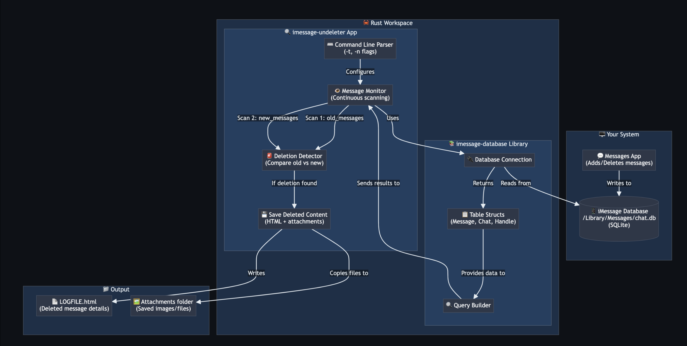

# 🕵️ iMessage Undeleter

A real-time monitor that detects and preserves deleted iMessages before they're gone forever.



## 🎯 What It Does

Tracks your iMessage database and logs messages which have been deleted, including:
- 📱 **Message text content** - Full text of deleted messages
- 🖼️ **Attachments** - Images, videos, and files that were deleted
- 👤 **Sender information** - Who sent the deleted message
- ⏰ **Timestamps** - When the message was originally sent

## 🏗️ How It Works

1. **Apple stores your messages** in a SQLite database (`/Library/Messages/chat.db`)
2. **imessage-database library** knows how to read that database  
3. **imessage-undeleter app** uses that library to continuously scan
4. **Your command** tells it which conversations to watch and how many messages
5. **The detection** works by comparing before/after snapshots
6. **When something disappears**, it saves the content before it's gone forever

## 🚀 Quick Start

### 1. Enable Full Disk Access (Required)

Your terminal needs permission to access the Messages database:

1. Open **System Settings** (or **System Preferences** on older macOS)
2. Go to **Privacy & Security** → **Full Disk Access**
3. Click the **+** button
4. Add your terminal application
5. Restart your terminal completely

### 2. Verify Permissions

Test that permissions work:
```bash
ls -la /Users/$USER/Library/Messages/
```

❌ **Failure**: "Operation not permitted" - repeat step 1

### 3. Run the Monitor

**Monitor all conversations:**
```bash
cargo run -p imessage-undeleter -- -n 100
```

**Monitor specific phone number:**
```bash
cargo run -p imessage-undeleter -- -t "+1234567890" -n 100
```

## 📋 Command Options

| Flag | Description | Example |
|------|-------------|---------|
| `-n <number>` | **Sliding window size** - how many recent messages to monitor | `-n 100` |
| `-t <filter>` | **Conversation filter** - specific phone/email to monitor | `-t "+1234567890"` |
| `-p <path>` | **Database path** - custom chat.db location | `-p /path/to/chat.db` |
| `-o <path>` | **Output directory** - where to save deleted messages | `-o ./my_output` |

## 🔍 What You'll See

### Normal Operation
```
🔍 Starting iMessage deletion monitor...
📁 Deleted messages will be saved to: "./undeleted_messages/LOGFILE.html"
📂 Attachments will be saved to: "./undeleted_messages/attachments"
👀 Monitoring messages for phone number filter...
⏱️  Scanning every few seconds for changes...
```

### When Deletion Detected
```
🚨 DELETED MESSAGE DETECTED! "Hey, want to grab lunch?" with 1 attachment(s)
   👤 From: +1234567890
```

### Window Management (Normal)
```
📤 Message 12345 is no longer being tracked (removed from database)
   🗑️  Cleaning up 2 temporary attachment(s)
```

## 📁 Output Files

The monitor creates:
- **`./undeleted_messages/LOGFILE.html`** - Detailed log with timestamps, senders, and message content
- **`./undeleted_messages/attachments/`** - Preserved images, videos, and files

## 🧠 Understanding the Output

### ✅ What's Normal
- `💫 Scan #X - Still monitoring...` - App is working correctly
- `📤 Message X is no longer being tracked` - Message fell out of monitoring window (not deleted)

### 🚨 What Indicates Deletion
- `🚨 DELETED MESSAGE DETECTED!` - **This is what you want to see!**
- Content appears in `LOGFILE.html` with full details